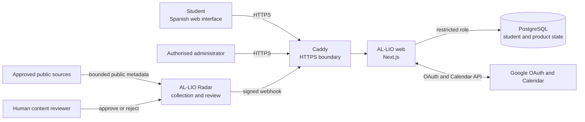
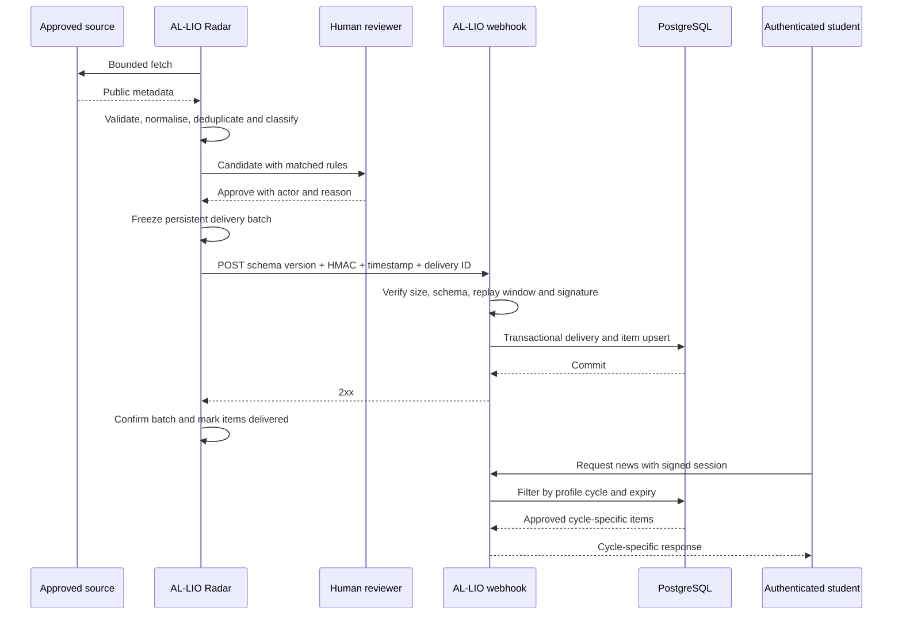

# Architecture, data governance, privacy and security

Report-source material for issue #298. This document explains AL-LIO's runtime
topology, trust boundaries, content governance and security controls so the
final report can describe them accurately without publishing secrets or
exploitable detail.

Mechanism claims below describe the reviewed source baseline unless marked
otherwise, and point to an architecture decision, executable configuration,
test or release record. They do not prove that the final production release is
already frozen or that an operator-owned control has already been exercised.
This document assigns stable architecture, security and governance evidence
IDs, which are represented in the consolidated evidence register
([`02-evidence-register.md`](02-evidence-register.md)).
Release-dependent values stay `planned` (`VER-004`, `OPS-001`, `OPS-003`).

Diagrams and topology below reflect the maintained architecture reference. The
final report must reconfirm them against the frozen release
([`01-delivery-brief.md`](01-delivery-brief.md)).

## 1. System context

Source: `docs/architecture/diagrams/system-context.md`.

- Students and administrators enter through the same HTTPS boundary and
  receive role-appropriate capabilities; `role` is a server-side column on the
  user record, never a client claim.
- PostgreSQL is reachable only by the web service (restricted runtime role)
  and the migrator job (separate operational credential). Radar has no
  database network membership.
- Google is an optional external integration. PostgreSQL remains the product
  source of truth; a Google outage does not invalidate AL-LIO-owned data.

## 2. Reviewed-content delivery

Source: `docs/architecture/diagrams/radar-delivery.md`.

Failure behaviour: a fetch or classification failure cannot create a published
item; pending and rejected candidates are never placed in an outbound batch; a
non-2xx response leaves the exact frozen batch pending for retry; reusing a
delivery identifier does not duplicate data; the profile filter is applied in
the server query, so a client cannot request another cycle's feed.

## 3. Services, responsibilities and prohibited access

Source: `infra/docker-compose.prod.yml`, `docs/architecture/ARCHITECTURE_AND_STACK.md`,
ADR-0001, ADR-0002.

| Service | Responsibility | Must not do | Persistent state |
|---|---|---|---|
| Host reverse proxy (Caddy) | Terminate public HTTPS and route to the web container | Hold application data or secrets beyond TLS material | None in this project |
| `al_lio_web` | Next.js UI, API, authentication, authorisation and integrations | Fetch arbitrary external sources; run schema migrations | PostgreSQL only |
| `al_lio_postgres` | Authoritative application, profile and delivered-content state | Accept connections from Radar | `al_lio_postgres_data` volume |
| `al_lio_radar` | Scheduled source collection, editorial review queue and signed delivery | Receive user sessions; connect to AL-LIO PostgreSQL; render a student UI | `al_lio_radar_data` volume |
| `al_lio_migrator` | Explicit, ordered schema migration job | Run during normal application startup; hold runtime privileges | None |

Network boundaries: `al_lio_web` and `al_lio_postgres` share an internal-only
Docker network; the migrator joins the same internal network under an `ops`
profile; Radar is deliberately absent from it and reaches only the public
HTTPS webhook. The web and Radar containers run as non-root, read-only
filesystem, `no-new-privileges`, all Linux capabilities dropped, with memory,
CPU, PID and log-rotation limits.

## 4. Security and access-control mechanisms

### 4.1 Signed application sessions

Source: `src/lib/auth/session.ts`, `src/lib/auth/session-token.ts`,
`docs/architecture/AUTH_AND_ONBOARDING_FLOWS.md`.

- The session is a signed, `HttpOnly`, `SameSite=Lax` cookie with a 30-day
  lifetime, `Secure` in production, issued only from a Server Action or Route
  Handler.
- `src/middleware.ts` performs signature-only verification (Edge runtime, no
  database) to gate private paths and bounce authenticated users away from the
  public auth pages.
- Server components, server actions and route handlers additionally call
  `getValidatedSession`, which compares a database-backed `security_stamp`.
  Regenerating that stamp (for example on password reset) revokes every
  previously issued cookie, including for direct action and API calls.

### 4.2 Authentication and onboarding gates

Source: `src/lib/auth/`, `src/app/(dashboard)/layout.tsx`, ADR-0007,
`tests/integration/auth/`, `tests/integration/onboarding/gate.test.mjs`.

- Sign-in paths: Google OAuth (minimal `openid`/`email`/`profile` scope, PKCE)
  and password access for confirmed accounts. Public registration creates an
  unconfirmed account; the account cannot sign in until the emailed
  confirmation link is used.
- Rate limiting is applied to password login, registration, demo access and
  password-reset requests, backed by a shared database table rather than
  process memory.
- The dashboard layout is a single onboarding gate: every private route
  renders through it, and a session whose profile has no completed
  questionnaire (vocational cycle and academic year) is redirected to
  `/onboarding` before any application content renders. A fully onboarded user
  passes straight through.
- Production demo access is disabled by default.

### 4.3 Server-side authorisation and user ownership

Source: `src/features/*/server/`, `src/lib/db/repositories/`, ADR-0008,
`tests/architecture/features/boundaries.test.mjs`, `scripts/check-feature-boundaries.mjs`.

- The App Router owns URL and route-level access control. Product mutations
  run as explicit Next.js Server Actions that resolve the user from the
  validated session and never accept a user id from the request body.
- Repository queries are scoped by the server-derived user id; ownership
  checks are not delegated to the client.
- Automated boundary checks prevent client barrels from re-exporting
  server-only repositories, sessions or secrets, and prevent a return to a
  single UI "god component".

### 4.4 PostgreSQL roles and the migration boundary

Source: ADR-0001, `infra/postgres/schema.sql`,
`infra/postgres/migrations/README.md`, `infra/docker-compose.prod.yml`,
`scripts/postgres/migrate.mjs`.

- The web service connects through a restricted runtime role with runtime
  privileges only.
- Schema evolution uses ordered, uniquely named, transactional, checksummed
  SQL migrations applied through a separate `DATABASE_MIGRATION_URL`
  credential and a dedicated migrator service that starts only under the `ops`
  profile.
- Migrations use forward-compatible (`expand`/`contract`) changes and avoid
  `DROP`, `TRUNCATE` and destructive conversions; they are rehearsed against a
  restored production backup first.
- A database without verified migration history is rejected until an explicit
  baseline audit and restore rehearsal succeed.

### 4.5 HMAC-authenticated Radar delivery, replay protection and idempotency

Source: ADR-0003, `src/lib/radar/webhook-auth.ts`, `src/lib/radar/signature.ts`,
`src/lib/radar/contract.ts`, `src/app/api/radar/v1/ingest/route.ts`,
`tests/` Radar contract and signature tests.

- `POST /api/radar/v1/ingest` requires `Content-Type: application/json`,
  enforces a maximum body size, and rejects an unconfigured or too-short
  shared secret with a `503`.
- Each request carries a delivery identifier (validated as a UUID), an ISO
  timestamp, a schema-version header and an HMAC-SHA256 signature over the
  timestamp, delivery identifier and raw body. Requests outside the replay
  window, with an unsupported schema version, a mismatched declared schema
  version, an invalid contract, or a delivery-id mismatch are rejected and
  audited.
- Ingestion is a single PostgreSQL transaction with delivery-level and
  item-level idempotency: a duplicate delivery returns `200` without
  re-applying data; a fresh delivery returns `201`. Responses are
  `Cache-Control: no-store`.
- The supported schema-version set is defined in `src/lib/radar/contract.ts`
  (`RADAR_SUPPORTED_SCHEMA_VERSIONS`). The exact version(s) accepted by the
  frozen release must be confirmed at release time; existing prose in older
  documents that names a single version is historical.

### 4.6 Human review before publication

Source: ADR-0003, `docs/integrations/` governance documents,
`docs/architecture/diagrams/radar-delivery.md`, `docs/operations/monitoring.md`.

- Every currently enabled Radar source requires an auditable human approval,
  recorded with the acting reviewer and a reason, before an item can enter an
  outbound batch.
- Autonomous publication is disabled by default in production configuration.
- Editorial throughput is intentionally lower than automatic publication; the
  review queue and delivery outbox are monitored signals.

### 4.7 Google OAuth and the optional Calendar boundary

Source: `src/lib/google/identity.ts`, `src/lib/google/calendar.ts`, ADR-0002,
`docs/integrations/INTEGRATIONS_AND_DEEPLINKS.md`, auth and Calendar tests.

- Identity sign-in and Calendar consent are separate flows with separate
  cookies. Starting and completing Calendar consent require an existing
  validated AL-LIO session and do not create or link an account.
- Calendar is optional. Its access and refresh token material is encrypted with
  a dedicated key inside an `HttpOnly`, `SameSite=Lax` browser cookie (`Secure`
  in production); it is not stored in PostgreSQL or linked to the AL-LIO user
  row. In the reviewed baseline, Calendar status and event operations rely on
  possession of that cookie and do not independently revalidate the
  application session. The final report must not describe the credential as
  user-bound unless that boundary is strengthened and verified before release.
- OAuth state is validated and return paths are normalised. A Calendar failure
  does not affect AL-LIO-owned data.

### 4.8 Backup, recovery and rollback boundaries

Source: ADR-0005, `docs/operations/backup-and-recovery.md`,
`docs/operations/release-and-rollback.md`, `docs/operations/PRODUCTION_READINESS.md`,
`scripts/validate-production-deploy-readiness.mjs`. Collected values are owned
by issue #299.

- Releases deploy reviewed, SHA-tagged Docker images through Docker Compose,
  building candidate images before healthy services are stopped and retaining
  the previous image references for rollback. Only the services in the
  reviewed release unit are replaced; a web-only release does not touch Radar
  or PostgreSQL.
- Before a migration or risky change: a fresh PostgreSQL backup is created and
  restored into an isolated target, schema and migration validation run
  against the restored copy, Radar's writer is stopped for a consistent copy
  of its SQLite state, and both artefacts are transferred to encrypted
  off-host storage with recorded checksums.
- Recovery decision: image rollback for an application regression without data
  corruption; database restoration only for confirmed integrity loss or an
  unrecoverable migration; never a live down-migration during an incident.
- Post-merge CI success on `main` for an exact SHA triggers a guarded
  production deploy; CI failure blocks deployment (ADR-0006).

## 5. Data AL-LIO stores, and what Radar cannot access

Source: `infra/postgres/schema.sql`, `docs/architecture/README.md`, ADR-0002.

| Data | Owner | Notes |
|---|---|---|
| User identity, external-identity link, `role` and profile (email, display name, vocational cycle, academic year, onboarding state) | AL-LIO PostgreSQL | Password accounts store a bcrypt hash only |
| Tasks, notes (Bloc), learning progress, saved items and application state | AL-LIO PostgreSQL | User-scoped; server-side ownership |
| Personal task, course and event planning | AL-LIO PostgreSQL | User-owned records; the local calendar view is derived from these records rather than stored as a separate calendar |
| Delivered news and Radar-managed opportunities | AL-LIO PostgreSQL | Governed by review, publication, expiry and withdrawal rules |
| Curated learning resources and company catalogue entries | AL-LIO PostgreSQL | Curated catalogue data; companies are not represented as live vacancies |
| Session material | Signed cookie in the browser; `security_stamp` in PostgreSQL | No server-side session store of contents |
| Google Calendar token material (only if consented) | Encrypted `HttpOnly` browser cookie | Optional and revocable; not persisted in PostgreSQL and not user-row-bound in the reviewed baseline |
| Source catalogue, review decisions, delivery outbox | AL-LIO Radar SQLite volume | Separate backup and recovery procedure |

Radar has no user authentication, no student UI and no AL-LIO database
connection. It cannot read accounts, profiles, notes, tasks, calendar
entries, saved items, job applications, sessions or OAuth data. Its only
application integration is the signed one-way webhook.

## 6. Content provenance, approval, expiry, withdrawal and cycle targeting

Source: `docs/integrations/` governance documents,
`infra/postgres/migrations/` (Radar canonical-content, verified news,
opportunity catalogue, verified jobs, legacy-news withdrawals), the aggregate
queries `Q-DAT-001`–`Q-DAT-007` in `02-evidence-register.md`.

- **Provenance:** each student-facing item keeps its original public source
  and, for news, review/provenance information visible in the detail view.
- **Approval:** an item is publishable only after human approval; candidate,
  rejected and retired records are excluded from every published-content
  count.
- **Expiry and freshness:** news has a freshness window (shorter for general
  news than for legal notices); courses and events must satisfy current
  lifecycle or date rules; verified jobs must have an unexpired deadline.
- **Withdrawal:** an approved item can be withdrawn (`withdrawn_at`), which
  removes it from the student-facing boundary without deleting the audit
  record.
- **Cycle targeting:** items carry target vocational-cycle codes; the
  student-facing query filters by the profile cycle on the server. Curated
  company entries are a catalogue, not live vacancies, and must be labelled as
  such.

Counts for each of the above are `measured` values to be collected against the
frozen release and production cut-off using the register's aggregate queries;
they remain `planned` here.

## 7. Known limitations

Stated without secrets or unnecessary exploit detail. These limitations exist
in the reviewed source baseline; the final release must reconfirm them.

- **Security / operational:** several production controls are operator
  responsibilities that the repository cannot contain — off-host encrypted
  backup credentials and scheduler, external HTTPS uptime probes, host
  capacity and container-restart alerting, and Radar heartbeat/outbox
  alerting. Their configured status is `planned` until issue #299 records it.
- **Radar single-writer:** Radar runs one scheduler replica because its SQLite
  boundary is single-writer; horizontal scaling of the collector is not
  supported.
- **Editorial coverage:** learning-resource, news and opportunity coverage is
  not uniform across all cycles; coverage figures (`DAT-003`) must be reported
  per cycle, not as a single total.
- **Shared reverse proxy:** the application runs on one VPS behind a shared
  host proxy; there is no multi-node redundancy. Recovery relies on tested
  backups and image rollback, not automatic failover.
- **Accessibility:** the project targets WCAG 2.1 AA and respects reduced
  motion, keyboard navigation and contrast, but full end-to-end accessibility
  and browser E2E verification across every flow is not claimed; treat
  accessibility conformance as `expected` pending an audit.
- **Calendar session binding:** Calendar credentials are protected in an
  encrypted, `HttpOnly` cookie, but status and event operations in the reviewed
  baseline do not independently revalidate the AL-LIO session or bind the
  credential to a user row. Describe Calendar as optional and cookie-scoped;
  do not claim complete user-session binding without a later implementation
  and verification record.
- **Password reset for identity-only accounts:** an account that only ever
  signed in with Google cannot set a password through the reset flow in the
  reviewed baseline; it must continue signing in with Google.

## 8. Claim-to-evidence map

`Source` is the primary executable or documentary reference. The IDs below are
stable within this report source: `ARC-*` covers architecture boundaries,
`SEC-*` covers security controls, and `GOV-*` covers content governance. The
consolidated register uses these IDs without renumbering them. Existing
`DAT-*`, `QAL-*`, `OPS-*` and `VER-*` IDs are reused where those issues own the
measured or release-dependent evidence.

| Claim | Class | Source | Register ID |
|---|---|---|---|
| Explicit service trust boundaries with an internal-only database network and Radar excluded from it | implemented | `infra/docker-compose.prod.yml`; ADR-0002 | `ARC-001` |
| Self-hosted PostgreSQL is the product source of truth with a restricted runtime role and a separate migration credential | implemented | ADR-0001; `infra/postgres/`; `infra/docker-compose.prod.yml` | `ARC-002` |
| Signed, `HttpOnly`, `SameSite` session with database-backed stamp revocation | implemented | `src/lib/auth/session.ts`; `src/lib/auth/session-token.ts`; auth tests | `SEC-001` |
| Single central onboarding gate on every private route | implemented | ADR-0007; `src/app/(dashboard)/layout.tsx`; `tests/integration/onboarding/gate.test.mjs` | `SEC-002` |
| Server-side per-operation user scoping; no user id accepted from the request | implemented | ADR-0008; `src/features/*/server/`; `tests/architecture/features/boundaries.test.mjs` | `SEC-003` |
| HMAC-SHA256 signed Radar webhook with replay window, schema-version enforcement, transactional ingest and delivery/item idempotency | implemented | ADR-0003; `src/lib/radar/webhook-auth.ts`; `src/app/api/radar/v1/ingest/route.ts`; Radar contract/signature tests | `SEC-004` |
| Human approval required before any currently enabled source publishes; autonomous publication off by default | implemented | ADR-0003; `docs/integrations/`; `infra/docker-compose.prod.yml` | `GOV-001` |
| Google identity and Calendar are separate and optional; Calendar credentials are encrypted in a browser cookie but are not fully application-session-bound | implemented | `src/lib/google/identity.ts`; `src/lib/google/calendar.ts`; Calendar tests | `SEC-005` |
| Backup, isolated restore rehearsal and image-based rollback are defined release gates | implemented | ADR-0005; `docs/operations/backup-and-recovery.md`; `docs/operations/release-and-rollback.md` | `OPS-005`; measured `OPS-004` evidence pending in #299 |
| Post-merge CI gates the guarded production deploy | implemented | ADR-0006; `docs/operations/AUTONOMOUS_PRODUCTION_DEPLOY.md` | `QAL-003`; measured `QAL-001` execution evidence pending |
| Per-cycle content governance: provenance, approval, expiry, withdrawal and server-side cycle filter | implemented | `docs/integrations/`; `infra/postgres/migrations/`; `Q-DAT-001`–`Q-DAT-007` | `GOV-002`; measured values `DAT-001`–`DAT-007` pending |
| One immutable AL-LIO and Radar release baseline for all identifiers | planned | `01-delivery-brief.md` | `VER-004` |
| Final release live with a ready database boundary at the evidence cut-off | planned | `/api/health`, `/api/ready` | `OPS-001` |

## 9. Extraction boundary for the final PDF

The final technical report should extract only the information needed to
explain the design and justify trust in it:

- one concise system-context diagram with the web application, PostgreSQL,
  Google, Radar, approved sources and the human reviewer;
- one short reviewed-content flow showing collection, human approval, signed
  delivery and cycle-filtered presentation;
- the responsibility and data boundaries, the principal authentication,
  authorisation and content-governance controls, and the material limitations;
- final release evidence and measured values only after their register entries
  are verified.

Do not copy route names, header names, exact signature construction, cookie
names, repository paths, test filenames, migration commands or this complete
claim-to-evidence table into the PDF. They remain internal traceability
material. The report should describe what the controls achieve, not reproduce
an audit procedure or expose unnecessary operational detail.

## Final-collection items

- `ARC-001`–`ARC-002`, `SEC-001`–`SEC-005` and `GOV-001`–`GOV-002` are now
  represented in the consolidated evidence register with their original
  meaning and numbering.
- Release-dependent values (`VER-004`, `OPS-001`, `OPS-003`, `QAL-001`,
  `OPS-004`, all `DAT-*` counts) are completed by issues #299 and the
  final-compliance issue after the delivery release is frozen.
