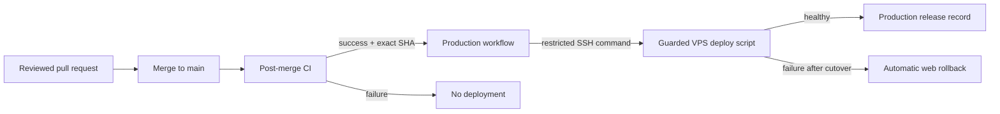
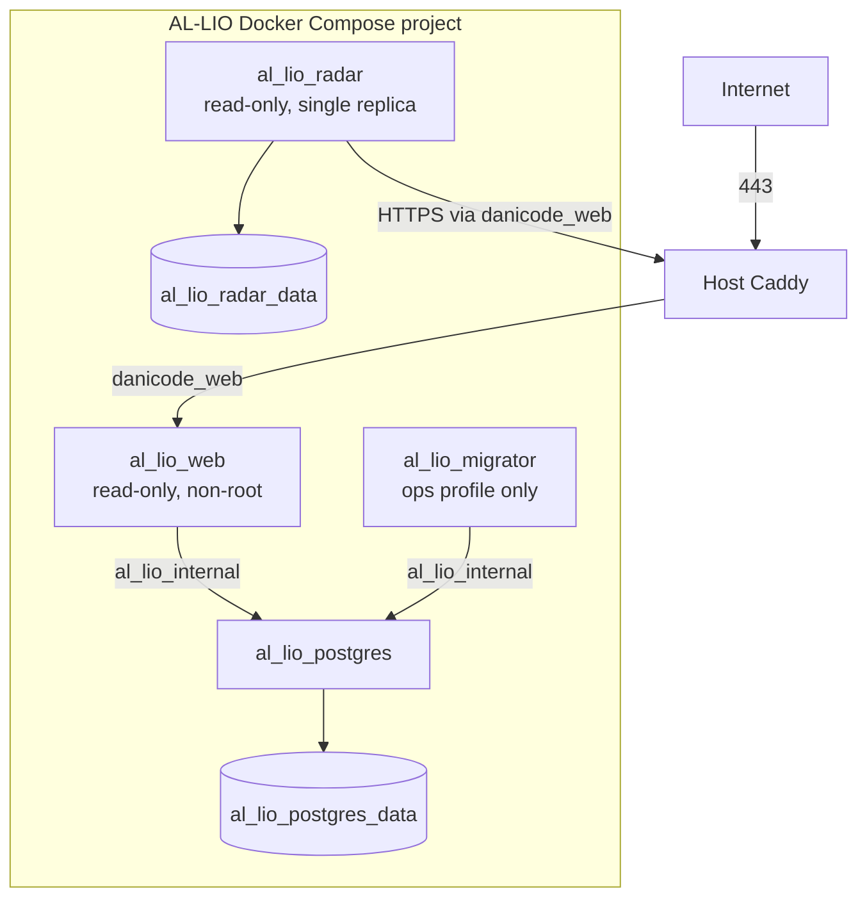

# Production deployment

## Release control flow

## Runtime topology

## Deployment rules

- `al_lio_internal` is an internal Docker network.
- Radar is intentionally absent from `al_lio_internal`.
- The migrator starts only through the `ops` profile.
- Web and Radar images use reviewed Git SHAs as tags.
- A web-only release replaces only `al_lio_web`.
- Persistent volumes are backed up independently before a release that can
  affect them.
