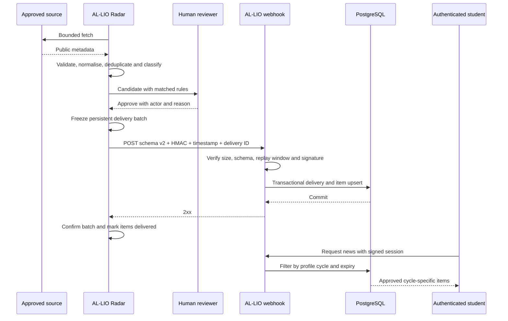

# Radar delivery sequence

## Failure behaviour

- Fetch or classification failure cannot create a published item.
- Pending and rejected candidates are never selected for an outbound batch.
- A non-2xx response leaves the exact frozen batch pending for retry.
- Reusing a successful delivery identifier does not duplicate data.
- A user cannot request another cycle's feed through a client-side filter; the
  profile filter is applied in the server query.
