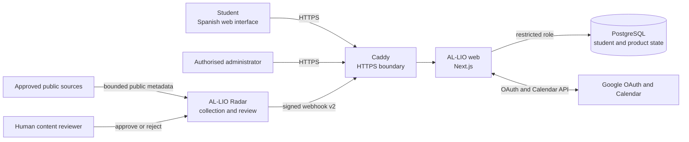

# System context

## Reading the diagram

- Students and administrators enter through the same HTTPS application
  boundary but receive role-appropriate capabilities.
- PostgreSQL is reachable by the web and migrator boundaries, not by Radar.
- Radar receives public source metadata and human editorial decisions, never
  student sessions.
- Google is an optional external integration; PostgreSQL remains the product
  source of truth.
